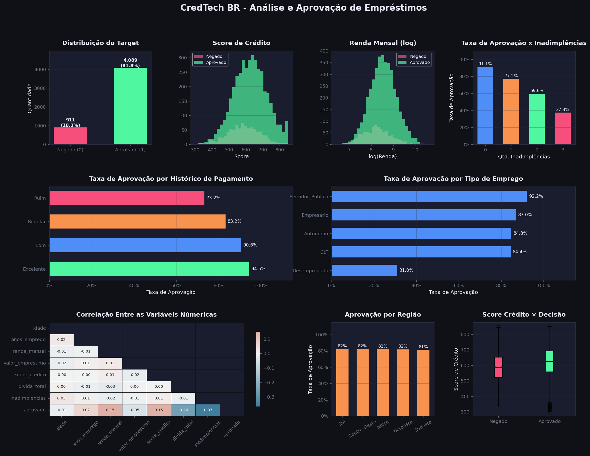
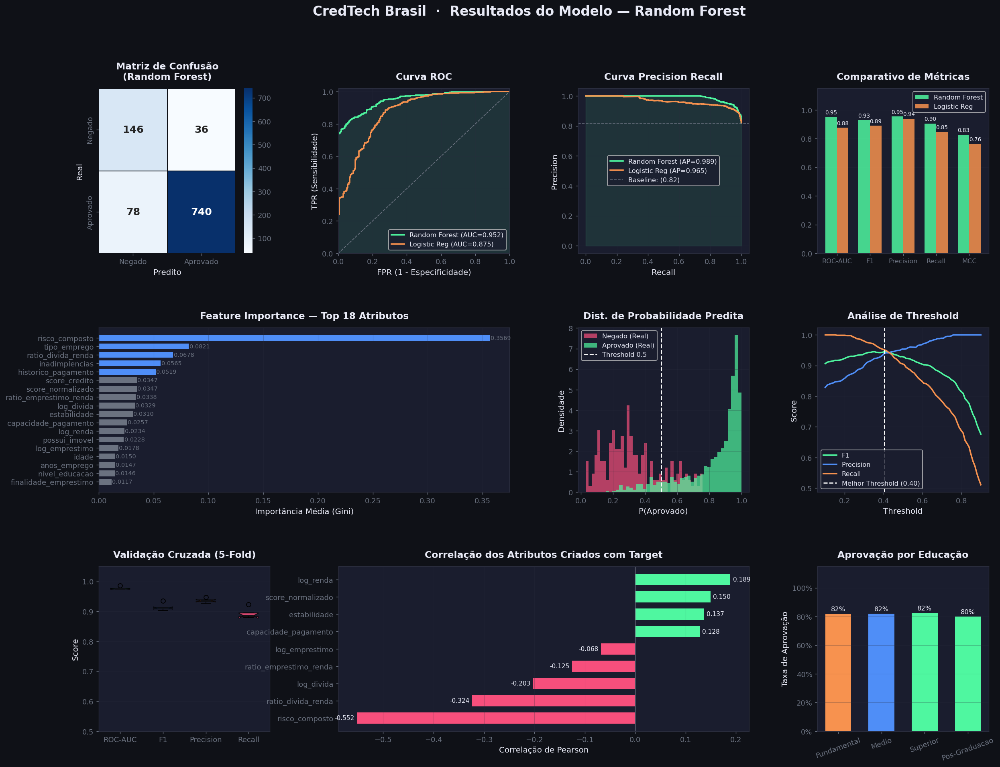

# 💳 Loan Approval Classification — CredTech Brasil

Projeto de Machine Learning para prever a **aprovação de empréstimos** com base em dados socioeconômicos do cliente. Desenvolvido como projeto de portfólio com pipeline completo: EDA, engenharia de atributos, modelagem e visualizações profissionais.

---

## 📌 Objetivo

Classificar se um cliente terá seu pedido de empréstimo **aprovado (1)** ou **negado (0)** com base em 20 variáveis financeiras e pessoais, lidando com um dataset propositalmente desbalanceado (~82% aprovado / ~18% negado), cenário comum em aplicações reais de crédito.

---

## 🗂️ Estrutura do Projeto

```
loan-approval-classification/
│
├── loan_data.csv               # Dataset com 5.000 registros
├── loan_approval_model.py      # Pipeline completo de ML
│
├── eda_overview.png            # Visualizações da análise exploratória
├── model_results.png           # Resultados e métricas do modelo
│
├── requirements.txt
├── .gitignore
└── README.md
```

---

## 📊 Sobre o Dataset

O dataset contém **5.000 registros** e **20 features** geradas sinteticamente com distribuições realistas para o contexto de crédito brasileiro.

| Variável | Tipo | Descrição |
|---|---|---|
| `idade` | Numérica | Idade do cliente (18–75) |
| `estado_civil` | Categórica | Solteiro, Casado, Divorciado, Viúvo |
| `nivel_educacao` | Categórica | Fundamental, Médio, Superior, Pós-Graduação |
| `num_dependentes` | Numérica | Número de dependentes (0–5) |
| `tipo_emprego` | Categórica | CLT, Autônomo, Servidor Público, Empresário, Desempregado |
| `anos_emprego` | Numérica | Tempo de emprego atual |
| `renda_mensal` | Numérica | Renda mensal em R$ |
| `regiao` | Categórica | Região do Brasil |
| `possui_imovel` | Binária | Proprietário de imóvel |
| `possui_veiculo` | Binária | Proprietário de veículo |
| `valor_emprestimo` | Numérica | Valor solicitado em R$ |
| `finalidade_emprestimo` | Categórica | Casa, Veículo, Educação, Saúde, Negócio, Pessoal |
| `score_credito` | Numérica | Score de crédito (300–850) |
| `divida_total` | Numérica | Dívida total atual em R$ |
| `inadimplencias` | Numérica | Número de inadimplências anteriores |
| `num_emprestimos_anteriores` | Numérica | Quantidade de empréstimos anteriores |
| `historico_pagamento` | Categórica | Excelente, Bom, Regular, Ruim, Péssimo |
| `tempo_conta_bancaria` | Numérica | Anos com conta bancária ativa |
| `num_contas_bancarias` | Numérica | Número de contas bancárias |
| `num_cartoes_credito` | Numérica | Número de cartões de crédito |
| `aprovado` | Binária | **Target** — 1: Aprovado, 0: Negado |

**Desbalanceamento:** ~82% aprovado / ~18% negado — tratado com **SMOTE**.

---

## ⚙️ Pipeline

### 1. Análise Exploratória (EDA)
- Distribuição do target e análise de desbalanceamento
- Score de crédito, renda e inadimplências por classe
- Taxa de aprovação por histórico de pagamento, tipo de emprego, região e educação
- Matriz de correlação entre variáveis numéricas

### 2. Engenharia de Atributos
Foram criados **9 novos atributos** a partir das features originais:

| Feature Criada | Fórmula / Lógica |
|---|---|
| `ratio_divida_renda` | `divida_total / renda_mensal` |
| `ratio_emprestimo_renda` | `valor_emprestimo / renda_mensal` |
| `capacidade_pagamento` | `renda_mensal / (valor_emprestimo / 60)` |
| `score_normalizado` | `(score_credito - 300) / 550` |
| `risco_composto` | Combinação de inadimplências, histórico e dívida |
| `estabilidade` | Combinação de emprego, imóvel e tempo de conta |
| `log_renda` | `log1p(renda_mensal)` |
| `log_divida` | `log1p(divida_total)` |
| `log_emprestimo` | `log1p(valor_emprestimo)` |

### 3. Modelo — Random Forest
Escolhido por:
- Alta performance em dados tabulares com features não-lineares
- Robusto a outliers e variáveis categóricas
- Fornece importância de atributos nativamente
- Comparado com Regressão Logística como baseline

### 4. Tratamento de Desbalanceamento — SMOTE
Oversampling sintético aplicado **somente no conjunto de treino** para evitar data leakage.

---

## 📈 Resultados

| Métrica | Random Forest | Logistic Regression |
|---|---|---|
| **ROC-AUC** | **0.9526** | 0.8753 |
| **F1-Score** | **0.9260** | 0.8880 |
| **Precision** | **0.9510** | 0.9375 |
| **Recall** | **0.9022** | 0.8435 |
| **MCC** | **0.6417** | 0.5171 |
| **Avg Precision** | **0.9893** | 0.9655 |

> CV ROC-AUC (5-Fold): **0.9772 ± 0.0043**

### 🏆 Top 5 Features mais importantes

| Feature | Importância |
|---|---|
| `risco_composto` | 36.06% |
| `tipo_emprego` | 8.29% |
| `ratio_divida_renda` | 6.57% |
| `inadimplencias` | 5.51% |
| `historico_pagamento` | 5.24% |

---

## 🖼️ Visualizações

### EDA Overview


### Resultados do Modelo


---

## 🚀 Como Executar

**1. Clone o repositório**
```bash
git clone https://github.com/seu-usuario/loan-approval-classification.git
cd loan-approval-classification
```

**2. Crie um ambiente virtual e instale as dependências**
```bash
python -m venv venv
source venv/bin/activate        # Linux/Mac
venv\Scripts\activate           # Windows

pip install -r requirements.txt
```

**3. Execute o pipeline**
```bash
python loan_approval_model.py
```

Os arquivos `eda_overview.png` e `model_results.png` serão gerados automaticamente na pasta do projeto.

---

## 🛠️ Tecnologias

- **Python 3.10+**
- `scikit-learn` — modelagem e métricas
- `imbalanced-learn` — SMOTE
- `pandas` / `numpy` — manipulação de dados
- `matplotlib` / `seaborn` — visualizações
